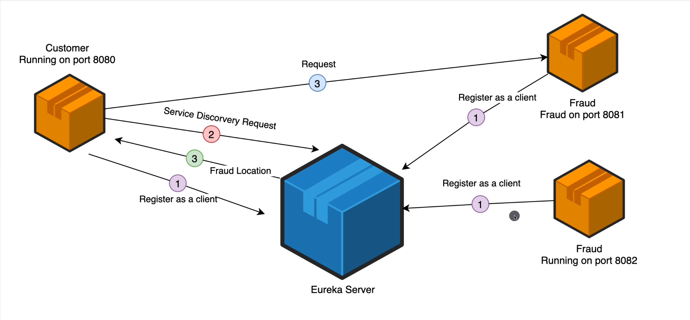

# Microservices and Distributed Systems
## Building and Deploying Microservices from scratch

## Software Architecture Description

## Software Architecture

## Links
- [Diagrams](https://www.diagrams.net/) | Draw Software Architecture Diagrams
- [Maven](https://maven.apache.org/guides/mini/guide-creating-archetypes.html) | Guide to Creating Archetypes
- [Spring Cloud](https://spring.io/projects/spring-cloud) | Spring Cloud Documentation, bring all microservices together
- [Spring Boot Banner](https://devops.datenkollektiv.de/banner.txt/index.html) | Create Own Spring Boot Banner
- 

## Cheat Sheet
#### Maven
- mvn archetype:generate -DgroupId=com.syscomz -DartifactId=syscomzservices -DarchetypeArtifactId=maven-archetype-quickstart -DarchetypeVersion=1.4 -DinteractiveMode=false | Maven Creating Archetypes
- docker-compose up -d | Run Docker Compose File
- docker-compose ps | shows ran processes
- 

## Notes
- Create Maven Multi-Module Project
  - Create Maven Parent Module
    - First create new project trough maven 
      - mvn archetype:generate -DgroupId=com.syscomz -DartifactId=syscomzservices -DarchetypeArtifactId=maven-archetype-quickstart -DarchetypeVersion=1.4 -DinteractiveMode=false | Maven Creating Archetypes
    - Second delete src folder on the parent module
    - Third make pom.xml configuration
- To create new instance from microservice we should click on Edit Configurations from the tab that is placed before play button in the main screen top right. After that we should create a copy of the microservice that we want a new instance. Into Program Arguments tab we must add **--server.port=8085** that specify new port of our instance of the microservice, and then click play button (run button)

## Description
- Maven Multi-Module Project
> A multi-module project is built from an aggregator POM that manages a group of submodules. In most cases, the aggregator is located in the project's root directory and must have packaging of type pom.
The submodules are regular Maven projects, and they can be built separately or through the aggregator POM. The significant advantage of using this approach is that we may reduce duplication.

  - Create new module Customer **on the root directory right click and create new module** (add banner.txt, application.yml, @SpringBootApplication, docker database  **good practice each microservice should have own database**)
  - Create docker postgres database and pgadmin (in psql on the tab write host_name/address: postgres this network bridge between two containers \[pgadmin and psql\] )
  - Create new module Fraud (add banner.txt, application.yml, @SpringBootApplication, docker database **good practice each microservice should have own database** in this example I am using one database for all my microservices because lack of memory)

- Microservice Communication via HTTP
  - We have running two microservices \[Customer:8080 -> send request via HTTP:8081 to -> Fraud:8081\]
  - This communication can be achieved via multiple ways for example: Rest Template, Service Discovery, and Open Feign **which is mostly used**
  - For Rest Template implementation check CustomerService, and CustomerConfig

- Service Discovery with Eureka
  - Create new module for Eureka Server (add pom.xml dependencies)
  - We have running three microservices \[Customer:8080 -> send request via HTTP:8081, HTTP:8085 to -> Fraud:8081, and Fraud:8085\]. In this example our Customer microservice should send request via HTTP to two Fraud microservices on different port. To be done this the Customer microservice should know for all the existing ports for Fraud microservice. This can be problem for example if Fraud scale to then instances, then the Customer microservice should know about all the ports of the Fraud microservice. Here it comes the Service Registry to solve this problem. When we are using Kubernetes we won't need the Eureka Server.
  - Service Discovery is the process of automatically detecting devices and services on a network
  - For example, we have Eureka Server which knows all the client applications (Microservices, also called Eureka Clients) running on each port and IP address.
  - It is important to keep Eureka Server up and running because it keeps all the data about the microservices
  - The steps are:
    - Register - clients will register themselves into Eureka Server (server will know the host and the port of the clients)
    - Lookup - when microservice need to talk to another microservice, they will lookup this information into Eureka Server 
    - Connect - and then the two microservices will connect to each other
    
    
  - Into pom.xml add Spring Cloud Dependency. It provides tools for developers to quickly build some common patterns in distributed systems (e.g. configuration management, service discovery, circuit breakers, intelligent routing, micro-proxy, control bus, one-time tokens, global locks, leadership election, distributed sessions, cluster state) 
  - View the sever information go to home page of Eureka Server the address is localhost:8761 port is given by me into application.yml file
  - When we configure the module eureka-server than we should configure also the clients
  - When we are using RestTemplate to make requests to the microservices we should give url path to the microservice for example http://localhost:8081/api/v1/fraud-check/{customerId} , but when we have more instances of our microservices then the port is different, and we cannot hard code the http path, here it comes the Eureka Server where we can have the information for the path and port of our microservices and allow them to communicate each other the http request should look like this http://FRAUD/api/v1/fraud-check/{customerId} for example. Where FRAUD is already registered Eureka Client microservice, and it can be viewed into http://localhost:8761/ address, the port is given by me into application.yml configuration file in eureka-server module.
  - When we have multiple microservices with same name for example Fraud:8081 and Fraud:8085 the request from Customer:8080 should be managed, it can be done with **load balancer**. Which is annotation that is added into CustomerConfig class the load balancer is added into class that makes the request
