# Microservices and Distributed Systems

## Building and Deploying Microservices from scratch

## Software Architecture Description

## Software Architecture

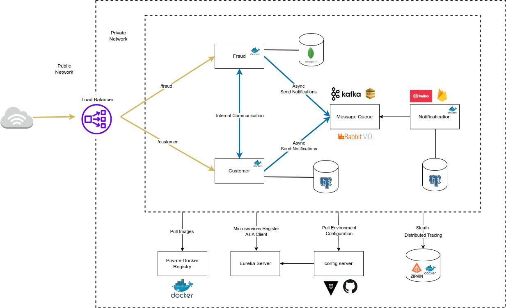

## Links

- [Diagrams](https://www.diagrams.net/) | Draw Software Architecture Diagrams
- [Maven](https://maven.apache.org/guides/mini/guide-creating-archetypes.html) | Guide to Creating Archetypes
- [Spring Cloud](https://spring.io/projects/spring-cloud) | Spring Cloud Documentation, bring all microservices together
- [Spring Boot Banner](https://devops.datenkollektiv.de/banner.txt/index.html) | Create Own Spring Boot Banner
- [Spring Cloud Netflix](https://spring.io/projects/spring-cloud-netflix) | Service Discovery (Eureka)
- [Open Feign](https://spring.io/projects/spring-cloud-openfeign) | Open Feign Documentation
- [Spring Cloud Sleuth](https://spring.io/projects/spring-cloud-sleuth) | Spring Cloud Sleuth provides Spring Boot
  auto-configuration for distributed tracing.
- [Open Tracing](https://opentracing.io/) | Distributed tracing, also called distributed request tracing, is a method
  used to profile and monitor applications, especially those built using a microservices architecture. Distributed
  tracing helps pinpoint where failures occur and what causes poor performance.
- [Zipkin](https://zipkin.io/) | Zipkin is a distributed tracing system. It helps gather timing data needed to
  troubleshoot latency problems in service architectures. The Zipkin UI also presents a Dependency diagram showing how
  many traced requests went through each application.
- [Docker Compose for Zipkin](https://github.com/openzipkin-attic/docker-zipkin/blob/master/docker-compose.yml) | Zipkin
  configuration for docker-compose file
- [Spring Cloud Gateway](https://spring.io/projects/spring-cloud-gateway) | **this is load balancer from spring cloud
  for local usage**  and it's aims to provide a simple, yet effective way to route to APIs and provide cross-cutting
  concerns to them such as: security, monitoring/metrics, and resiliency.
- [RabbitMQ AMQP 0-9-1 Model Explained](https://www.rabbitmq.com/tutorials/amqp-concepts.html) | This guide provides an
  overview of the AMQP 0-9-1 protocol, one of the protocols supported by RabbitMQ.
- [Apache Kafka](https://kafka.apache.org/) | **Apache Kafka** is an open-source distributed **event streaming platform
  ** used by thousands of companies for high-performance data pipelines, streaming analytics, data integration, and
  mission-critical applications.
- [RabbitMQ](https://www.rabbitmq.com/) | **RabbitMQ** is the most widely deployed open source **message broker**.
- [Amazon SQS](https://aws.amazon.com/sqs/) | **Amazon SQS** is a fully managed **message queuing** for microservices,
  distributed systems, and serverless applications
- [When to use RabitMQ over Kafka?](https://stackoverflow.com/questions/42151544/when-to-use-rabbitmq-over-kafka) | When
  to use RabitMQ over Kafka?
- [RabbitMQ Tutorials](https://www.rabbitmq.com/tutorials/amqp-concepts.html) | AMQP Concepts
- [Apache Maven](https://maven.apache.org/index.html) | Apache Maven is a software project management and comprehension
  tool. Based on the concept of a project object model (POM), Maven can manage a project's build, reporting and
  documentation from a central piece of information.
- [Apache Maven Compiler Plugin](https://maven.apache.org/plugins/maven-compiler-plugin/) | The Compiler Plugin is used
  to compile the sources of your project.
- [Spring Boot Maven Plugin Documentation](https://docs.spring.io/spring-boot/docs/current/maven-plugin/reference/htmlsingle/) |
  It allows you to package executable jar or war archives, run Spring Boot applications, generate build information and
  start your Spring Boot application prior to running integration tests.
- [Apache Maven Lifecycle](https://maven.apache.org/guides/introduction/introduction-to-the-lifecycle.html) |
  Introduction to the Build Lifecycle
- [Jib Containerize Java Applications](https://github.com/GoogleContainerTools/jib) | Jib builds optimized Docker and
  OCI images for your Java applications without a Docker daemon - and without deep mastery of Docker best-practices. It
  is available as plugins for Maven and Gradle and as a Java library.
- [AdoptOpenJDK provides prebuilt OpenJDK DEPRICATED use Eclipse Temurin](https://hub.docker.com/_/adoptopenjdk) |
  AdoptOpenJDK provides prebuilt OpenJDK binaries from a fully open source set of build scripts and infrastructure.
- [Provide JRE (Java Runtime Environment) Images](https://hub.docker.com/_/eclipse-temurin/) | Official Images for
  OpenJDK binaries built by Eclipse Temurin.
- [Spring Profiles](https://docs.spring.io/spring-boot/docs/current/reference/html/features.html#features.profiles) |
  Spring Profiles provide a way to segregate parts of your application configuration and make it be available only in
  certain environments.
- [Remove Docker Images, Containers, and Volumes](https://www.digitalocean.com/community/tutorials/how-to-remove-docker-images-containers-and-volumes) |
  How To Remove Docker Images, Containers, and Volumes
- [Minikube](https://minikube.sigs.k8s.io/docs/) | Minikube website
- [Runtime options with Memory, CPUs, and GPUs](https://docs.docker.com/config/containers/resource_constraints/) | By
  default, a container has no resource constraints and can use as much of a given resource as the host’s kernel
  scheduler allows. Docker provides ways to control how much memory, or CPU a container can use, setting runtime
  configuration flags of the docker run command. This section provides details on when you should set such limits and
  the possible implications of setting them.
- [Kubernetes](https://kubernetes.io/) | Official page for kubernetes
- [Learn Kubernetes](https://kubernetes.io/docs/tutorials/kubernetes-basics/) | learn kubernetes basics
- [Install Tools for Kubernetes](https://kubernetes.io/docs/tasks/tools/) | Install Tools
- [Vault](https://www.vaultproject.io/) | Vault Secret manager tool, can keep secrets for environment variables like password for the kubernetes

## Cheat Sheet

- mvn spring-boot:run | usin spring boot to run the microservice
- java -jar file_name.jar | using java to run jar files

- docker network create postgres | for this project create postgres network
- docker volume create postgres | for this project create postgres volume
- docker inspect \[containerId\] | if the hostname doesn't work then show the container information, copy the Gateway IP
  address of the Postgres image, and paste it into hostname / address
- docker network prune | delete unused networks
- docker volume prune | delete unused volumes
- docker network ls | show networks
- docker volume ls | show volumes
- docker logs \[container_name\] | check the logs for the container
- docker-compose pull | pull the latest images from our Docker Hub repository
- docker info | show main docker information for total memory, CPUs and more
- minikube start --help | information about start of minikube cluster
- minikube start --memory=14g | setup minikube to use 14g memory
- minikube status | show the status of minikube
- minikube ip | show the ip address for our master node
- kubectl run container_name --image=image_name:version --port=80 | the port is that the container is listening on
- kubectl get pods | show all running pods
- kubectl port-forward pod/name_of_the_pod 8080:80 | expose the pod to localhost:8080
- kubectl delete pod pod_name | delete pod
- kubectl apply -f k8s/minikube/bootstrap/postgres | run all yml files
- kubectl describe pod pod_name | show pod information
- kubectl logs pod_name | show logs
- minikube ssh | login into minikube
- kubectl exec -it postgres-0 -- psql -U syscomz | login into postgres-0 pod and create sql database
- minikube service --url service_name | get the url
- kubectl get all | show all the resources - pods, services, and stateful-sets
- kubectl get services | show services
- minikube tunnel | If we want to access our LoadBalancers we can write minikube tunnel
- kubectl describe pod pod_name | show pod information
- kubectl logs pod_name -f | print logs
- kubectl get svc | show services (svc)
- kubectl scale --replicas=0 deployment k8s/minikube/services/customer | scale down the customer service from 1 to 0
- kubectl exec -it postgres-0 -- psql -U syscomz | login into postgres cli
- kubectl delete -f service_name | delete resources

#### Maven

- mvn archetype:generate -DgroupId=com.syscomz -DartifactId=syscomzservices
  -DarchetypeArtifactId=maven-archetype-quickstart -DarchetypeVersion=1.4 -DinteractiveMode=false | Maven Creating
  Archetypes
- docker-compose up -d | Run Docker Compose File
- docker-compose ps | shows ran processes

#### Zipkin

- docker run -d -p 9411:9411 openzipkin/zipkin | runs Zipkin into docker container

## Notes

- Create Maven Multi-Module Project
    - Create Maven Parent Module
        - First create new project trough maven
            - mvn archetype:generate -DgroupId=com.syscomz -DartifactId=syscomzservices
              -DarchetypeArtifactId=maven-archetype-quickstart -DarchetypeVersion=1.4 -DinteractiveMode=false | Maven
              Creating Archetypes
        - Second delete src folder on the parent module
        - Third make pom.xml configuration
- To create new instance from microservice we should click on Edit Configurations from the tab that is placed before
  play button in the main screen top right. After that we should create a copy of the microservice that we want a new
  instance. Into Program Arguments tab we must add **--server.port=8085** that specify new port of our instance of the
  microservice, and then click play button (run button)
- Cross-Origin Resource Sharing (CORS) is an HTTP-header based mechanism that allows a server to indicate any origins (
  domain, scheme, or port) other than its own from which a browser should permit loading resources.
- What Is Round-Robin Load Balancing? Round‑robin load balancing is one of the simplest methods for distributing client
  requests across a group of servers. Going down the list of servers in the group, the round‑robin load balancer
  forwards a client request to each server in turn.
- Maven lifecycle:
    - validate | validate the project is correct and all necessary information is available
    - compile | compile the source code of the project
    - test | test the compiled source code using a suitable unit testing framework. These tests should not require the
      code be packaged or deployed
    - package | take the compiled code and package it in its distributable format, such as a JAR.
    - verify | run any checks on results of integration tests to ensure quality criteria are met
    - install | install the package into the local repository, for use as a dependency in other projects locally
    - deploy | done in the build environment, copies the final package to the remote repository for sharing with other
      developers and projects.
- JAR: A JAR is a package file format typically used to aggregate may Java class files and associated metadata and
  resources into one file for distribution. JAR files are archive files that include a Java-specific manifest file. They
  are build on the Zip format and typically have a .jar file extension.

## Description

- Maven Multi-Module Project

> A multi-module project is built from an aggregator POM that manages a group of submodules. In most cases, the
> aggregator is located in the project's root directory and must have packaging of type pom.
> The submodules are regular Maven projects, and they can be built separately or through the aggregator POM. The
> significant advantage of using this approach is that we may reduce duplication.

- Create new module Customer **on the root directory right click and create new module** (add banner.txt,
  application.yml, @SpringBootApplication, docker database  **good practice each microservice should have own database
  **)
- Create docker postgres database and pgadmin (in psql on the tab write host_name/address: postgres this network bridge
  between two containers \[pgadmin and psql\] )
- Create new module Fraud (add banner.txt, application.yml, @SpringBootApplication, docker database **good practice each
  microservice should have own database** in this example I am using one database for all my microservices because lack
  of memory)

- Microservice Communication via HTTP
    - We have running two microservices \[Customer:8080 -> send request via HTTP:8081 to -> Fraud:8081\]
    - This communication can be achieved via multiple ways for example: Rest Template, Service Discovery, and Open Feign
      **which is mostly used**
    - For Rest Template implementation check CustomerService, and CustomerConfig

- Rest Template
    - Create requests from one microservice to another
    - The request with rest template looks like this http://localhost:8081/api/v1/fraud-check/{customerId}
    - The problem is that we must specify the domain name and the port
    - And when we are talking about scalability the port must be different for each new instance of the microservice.
      This is a problem because we can not hard code the data into our application, the data should be dynamically.

- Service Discovery with Eureka
    - Create new module for Eureka Server (add pom.xml dependencies)
    - We have running three microservices \[Customer:8080 -> send request via HTTP:8081, HTTP:8085 to -> Fraud:8081, and
      Fraud:8085\]. In this example our Customer microservice should send request via HTTP to two Fraud microservices on
      different port. To be done this the Customer microservice should know for all the existing ports for Fraud
      microservice. This can be problem for example if Fraud scale to then instances, then the Customer microservice
      should know about all the ports of the Fraud microservice. Here it comes the Service Registry to solve this
      problem. When we are using Kubernetes we won't need the Eureka Server.
    - Service Discovery is the process of automatically detecting devices and services on a network
    - For example, we have Eureka Server which knows all the client applications (Microservices, also called Eureka
      Clients) running on each port and IP address.
    - It is important to keep Eureka Server up and running because it keeps all the data about the microservices
    - The steps are:
        - Register - clients will register themselves into Eureka Server (server will know the host and the port of the
          clients)
        - Lookup - when microservice need to talk to another microservice, they will lookup this information into Eureka
          Server
        - Connect - and then the two microservices will connect to each other
          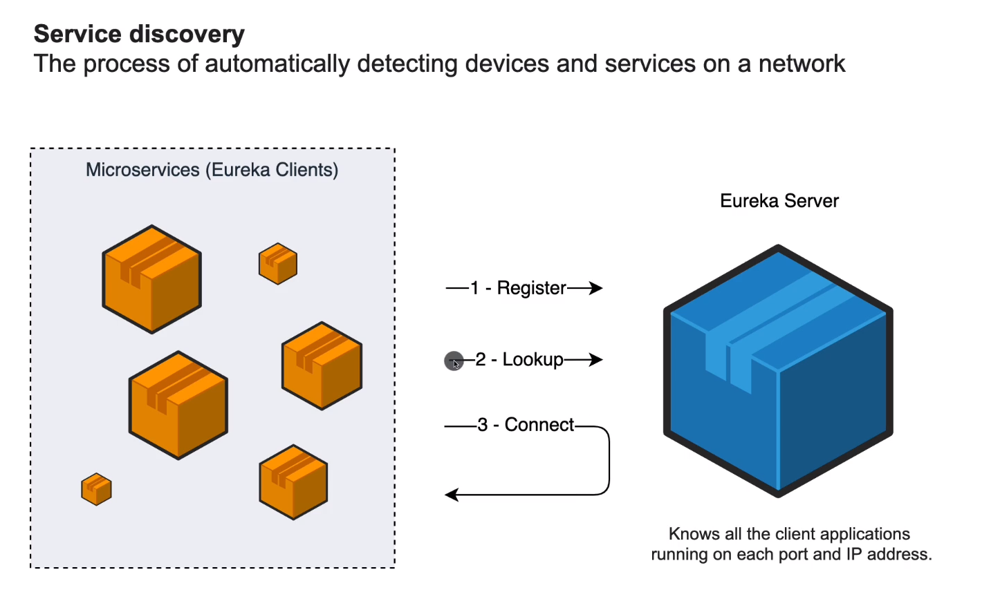
          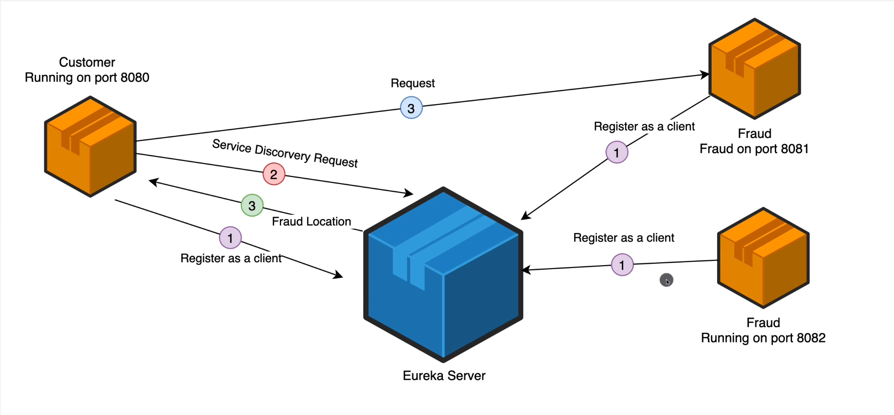
    - Into pom.xml add Spring Cloud Dependency. It provides tools for developers to quickly build some common patterns
      in distributed systems (e.g. configuration management, service discovery, circuit breakers, intelligent routing,
      micro-proxy, control bus, one-time tokens, global locks, leadership election, distributed sessions, cluster state)
    - View the sever information go to home page of Eureka Server the address is localhost:8761 port is given by me into
      application.yml file
    - When we configure the module eureka-server than we should configure also the clients
    - When we are using RestTemplate to make requests to the microservices we should give url path to the microservice
      for example http://localhost:8081/api/v1/fraud-check/{customerId} , but when we have more instances of our
      microservices then the port is different, and we cannot hard code the http path, here it comes the Eureka Server
      where we can have the information for the path and port of our microservices and allow them to communicate each
      other the http request should look like this http://FRAUD/api/v1/fraud-check/{customerId} for example. Where FRAUD
      is already registered Eureka Client microservice, and it can be viewed into http://localhost:8761/ address, the
      port is given by me into application.yml configuration file in eureka-server module.
    - When we have multiple microservices with same name for example Fraud:8081 and Fraud:8085 the request from
      Customer:8080 should be managed, it can be done with **load balancer**. Which is annotation that is added into
      CustomerConfig class the load balancer is added into class that makes the request

- Open Feign
    - OpenFeign dependency **spring-cloud-starter-openfeign**
    - Create new module for internal and external clients call it **clients**
    - Create interface for each new client with annotation @FeignClient and add some parameters
    - OpenFeign still uses EurekaServer to find needed microservices, but not the RestTemplate to create requests to
      them.

- Distributed Tracing
    - Spring Cloud Sleuth | Spring Cloud Sleuth provides Spring Boot auto-configuration for distributed tracing. Sleuth
      configures everything you need to get started. This includes where trace data (spans) are reported to, how many
      traces to keep (sampling), if remote fields (baggage) are sent, and which libraries are traced.
        - Add Spring Cloud Sleuth dependency to all microservices
        - In the response into stack trace we have the log which comes from **log.info("new customer registration {}",
          customerRegistrationRequest);**, and Spring Cloud Sleuth add additional information *
          *[customer,1b32e5c110aeae9b,1b32e5c110aeae9b]** where this is the trace id **1b32e5c110aeae9b**, and this
          1b32e5c110aeae9b is **span** id they are added because of **log** command
        - When we go from customer, to the fraud microservice will see that the trace id into customer is the same as
          this into fraud trace id, but the span ids are different. This pattern is the same also into notification
          microservice.
            - [customer,a86f2368573ce95f,a86f2368573ce95f] vs [fraud,a86f2368573ce95f,4bdf86c263154fe5]
              vs [notification,a86f2368573ce95f,c64809a52a015a37]
            - 2023-01-29 08:18:56.760 INFO [customer,1b32e5c110aeae9b,1b32e5c110aeae9b] 20162 --- [nio-8080-exec-1]
              com.syscomz.customer.CustomerController  : new customer registration
              CustomerRegistrationRequest[firstName=Borislav, lastName=Dostumski, email=b.dostumski@gmail.com]
        - Spring Cloud Sleuth dependency uses Sl4j to add the information about microservice, also Trace ID and Span ID
          that will be used into Zipkin to show the information about the microservices
    - Zipkin | Zipkin is a distributed tracing system. It helps gather timing data needed to troubleshoot latency
      problems in service architectures. Features include both the collection and lookup of this data. If you have a
      trace ID in a log file, you can jump directly to it. Otherwise, you can query based on attributes such as service,
      operation name, tags and duration. Some interesting data will be summarized for you, such as the percentage of
      time spent in a service, and whether or not operations failed.
        - Zipkin is UI that shows the information about communication between microservices that uses the data given
          from Sl4j and Spring Cloud Sleuth
        - docker run -d -p 9411:9411 openzipkin/zipkin | runs Zipkin into docker container
        - Rerun docker compose file into detached mode
        - The default port of Zipkin is 9411
        - **docker logs zipkin** shows zipkin logs
        - When everything is ready into Zipkin UI click Run Query to see the data.
        - If I want to search for a specific Trace ID I can copy it from the trace log and paste it into the search bar.
          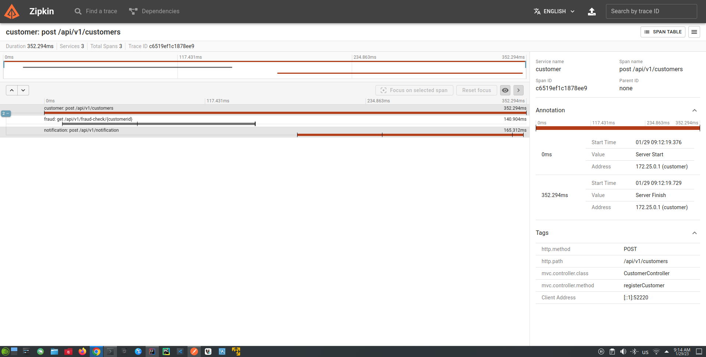
          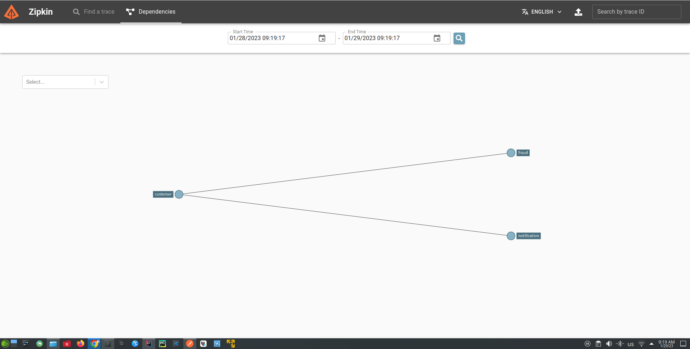

- API Gateway With Spring Cloud Gateway
    - Load Balancer refers to efficiently distributing incoming network traffic across a group of backend services.
        - Transport Layer Security (TLS)? is a cryptographic protocol designed to provide communications security over a
          computer network.
        - Certificate Management?
        - Authentication? where do we authenticate the request (it can be within every single microservice, or within
          external load balancer), where do we terminate the TLS
        - High Availability? this mean that it is always up and running no mather what. Is it CORS or not? Cross-Origin
          Resource Sharing (CORS) is an HTTP-header based mechanism that allows a server to indicate any origins (
          domain, scheme, or port) other than its own from which a browser should permit loading resources.
        - Loggin?
        - Caching?
        - Path Based Routing? Instead of we're having multiple external load balancers for each microservice we just
          have one and base on the path we can redirect the request to the appropriate internal load balancer.
        - We don't need to take this decisions described above we can just allow our cloud provider manage the external
          load balancer, and we can just focus on our microservices and our own business logic.
        - [Google Cloud Load Balancer description example](https://cloud.google.com/load-balancing)
        - [AWS Load Balancer description example](https://aws.amazon.com/elasticloadbalancing/)
        - [NGINX Load Balancer documentation](https://docs.nginx.com/nginx/admin-guide/load-balancer/http-load-balancer/)
          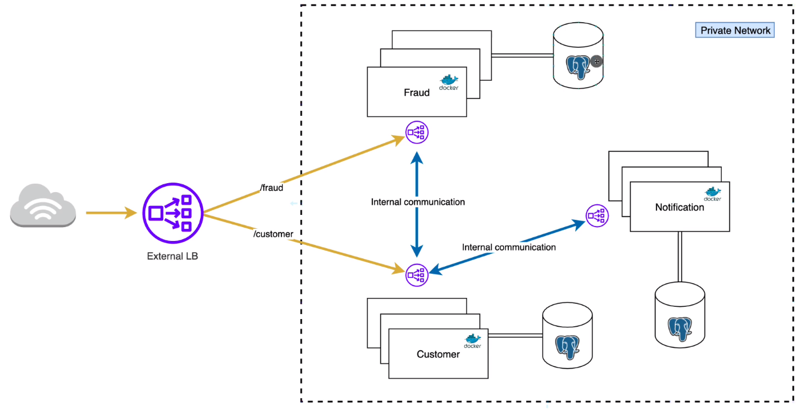
    - Load Balancer Algorithms
        - The load balancer algorithm can be chosen: the most commonly used is (**Round Robin - Requests are distributed
          across the group of services sequentially**). For example if we have nodes with addresses 192.168.1.2 and
          192.168.1.3. When we make a request the load balancer will send the request first into 192.168.1.2 and after
          that if we make another request the load balancer will send this request to the node with address 192.168.1.3.
        - This is an example for NGINX but if we choose for example AWS Elastic Load Balancing then we should check the
          algorithms that they present
          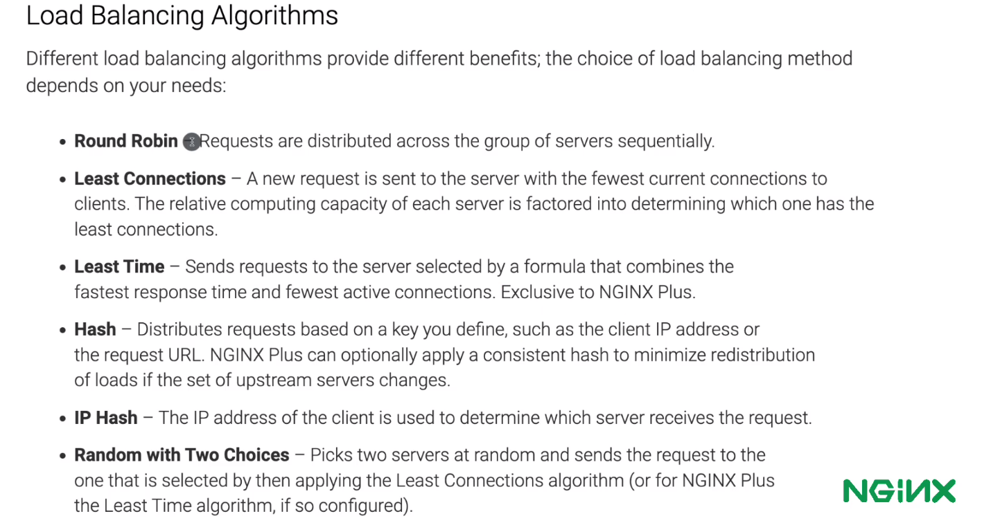
    - Load Balancer Health Checks
        - Load balancer checks for the health of the microservices if the health is OK 200 then the load balancer will
          send the request.
        - There are different ways to define the health checks for the microservice. Take a look the example below the
          PDF microservice does not use database and we can check only if the microservice is up and running, but for
          the Customer microservice we are using also a database, then the health check will be is the microservice up
          and running and also can them microservice connect to the database. Then if all of this checks pass then the
          Customer microservice will send OK 200 status back to the load balancer.  
          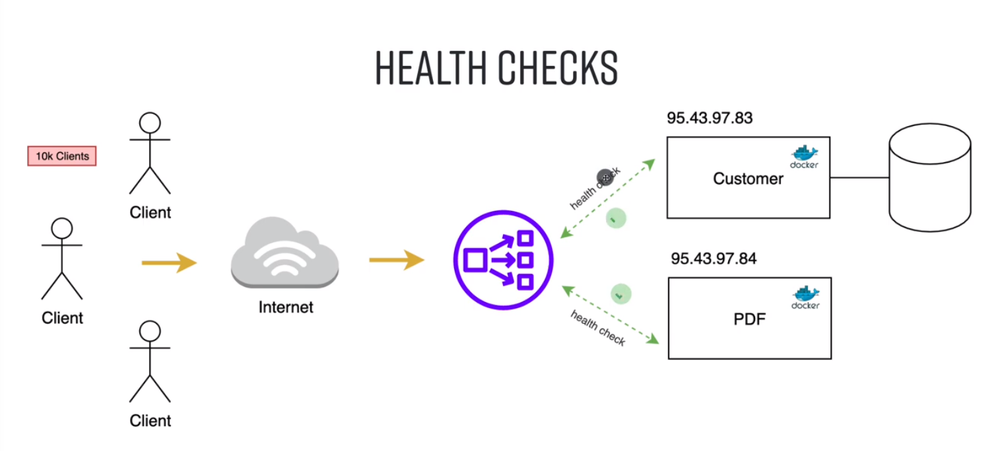
    - Spring Cloud Gateway **this is load balancer from spring cloud for local usage** (This project provides a library
      for building an API Gateway on top of Spring WebFlux. Spring Cloud Gateway aims to provide a simple, yet effective
      way to route to APIs and provide cross cutting concerns to them such as: security, monitoring/metrics, and
      resiliency.)
        - This is for leaning purposes, we must use predefined load balancers from AWS, Google, and others.
        - I am using this load balancer configuration into **apigw** (api gateway) module
        - As we know all the application is protected by private network, only the **external load balancer** can make
          requests to the microservices. While I am into local machine this is not a problem because I can make requests
          directly to the microservices without load balancer for example POST request to localhost:
          8080/api/v1/customers end point in the local machine it will work fine, but when we are upload our application
          into cloud provider then it will be permitted for us to make requests to the private network, only the load
          balancer will do this.
        - To test load balancer requests we should change the port from this of the microservice localhost:
          8080/api/v1/customers to this of the load balancer which is localhost:8083/api/v1/customers
          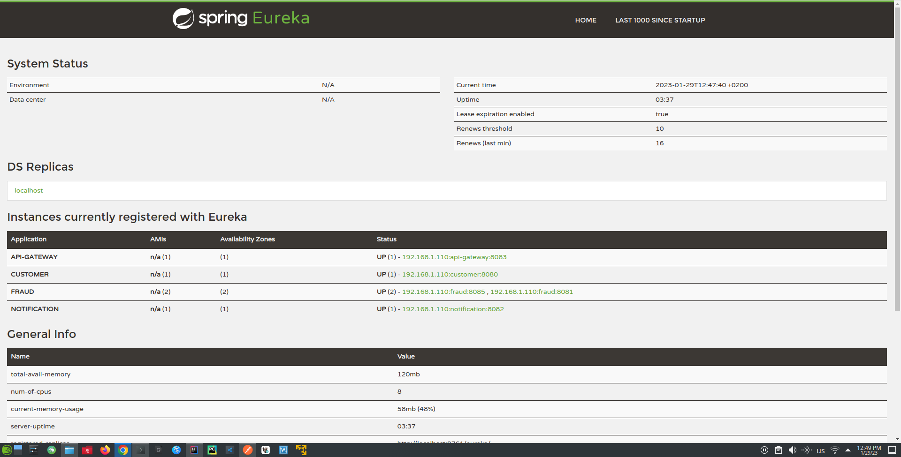
        - When we check the request into Zipkin we will see that it was made a POST request to the api-geteway, and then
          the api-getway send it to the customer from customer it went to fraud and again to notification.
          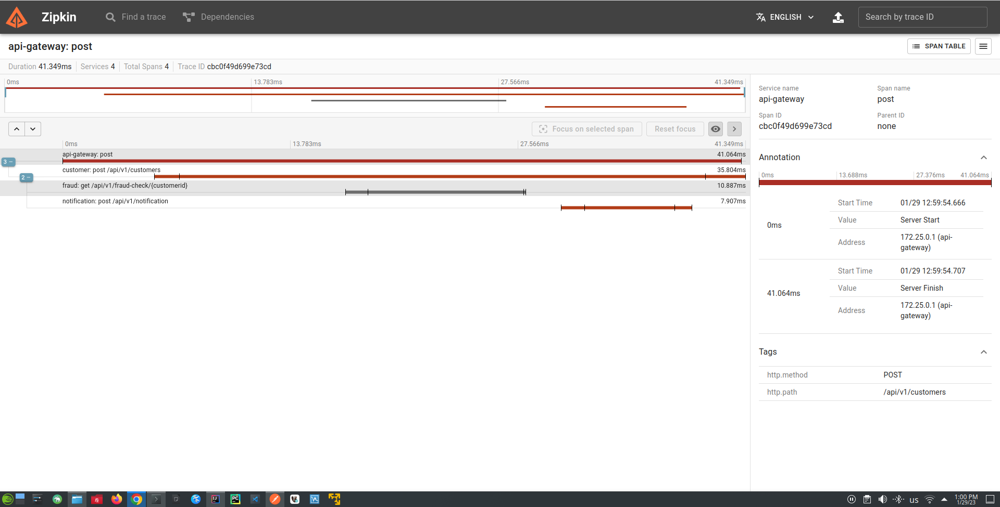
    - Message Queues
        - When we have a service that takes more time to be executed, and the response doesn't have to be immediate we
          can use asynchronous requests (in this project Notification microservice will receive async requests).
        - Simulate Slow Responses (into NotificationController microservice): when we add a breakpoint into
          NotificationController and make a request from Postman will see that the request goes to the breakpoint and
          the Postman freezes until waiting for the response or get error status code 500)
        - In Zipkin we can check the calls that we made.
        - To solve this problem will create MessageQueue microservice with (Kafka, RabbitMQ AMQP 0-9-1 Protocol) in it.
        - AMQP 0-9-1 (Advanced Message Queuing Protocol) is a messaging protocol that enables conforming client
          applications to communicate with conforming messaging middleware brokers.
          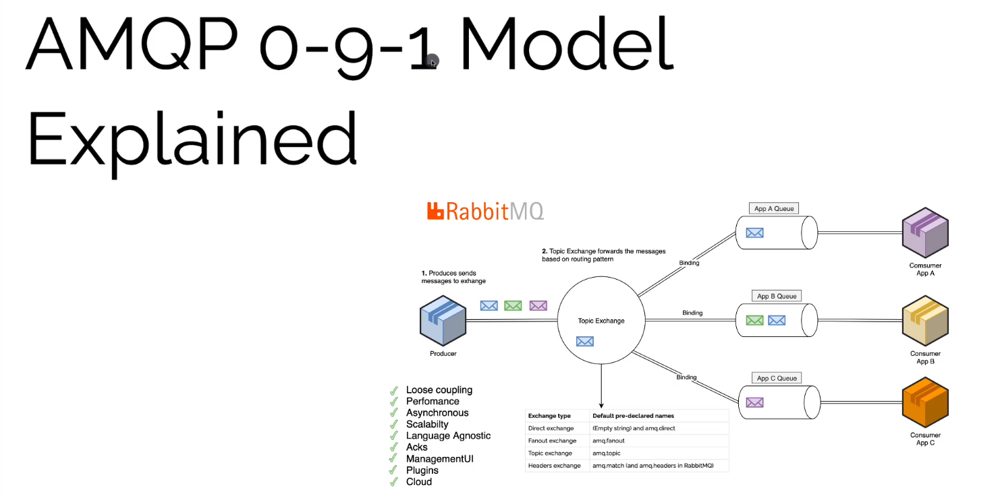
        - Brokers and Their Role
          -Messaging brokers receive messages from publishers (applications that publish them, also known as producers)
          and route them to consumers (applications that process them).
            - Since it is a network protocol, the publishers, consumers and the broker can all reside on different
              machines.
              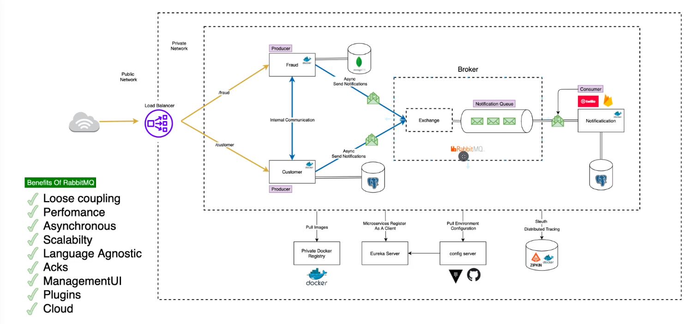
        - If the Notification microservice is down then the Broker will receive the messages from Fraud and Customer
          microservices and will store them in Notification Queue, until the Notification microservice is up and running
          again.
        - Messages in Notification Queue, are not get removed unless the consumer acknowledges (Acks) that it has
          receive the message.
        - When to use RabbitMQ over Kafka?
          from https://stackoverflow.com/questions/42151544/when-to-use-rabbitmq-over-kafka
            - RabbitMQ is a solid, general-purpose message broker that supports several protocols such as AMQP, MQTT,
              STOMP, etc. It can handle high throughput. A common use case for RabbitMQ is to handle background jobs or
              long-running task, such as file scanning, image scaling or PDF conversion. RabbitMQ is also used between
              microservices, where it serves as a means of communicating between applications, avoiding bottlenecks
              passing messages.
            - Kafka is a message bus optimized for high-throughput ingestion data streams and replay. Use Kafka when you
              have the need to move a large amount of data, process data in real-time or analyze data over a time
              period. In other words, where data need to be collected, stored, and handled. An example is when you want
              to track user activity on a webshop and generate suggested items to buy. Another example is data analysis
              for tracking, ingestion, logging or security.
            - Kafka can be seen as a durable message broker where applications can process and re-process streamed data
              on disk. Kafka has a very simple routing approach. RabbitMQ has better options if you need to route your
              messages in complex ways to your consumers. Use Kafka if you need to support batch consumers that could be
              offline or consumers that want messages at low latency.
            - In order to understand how to read data from Kafka, we first need to understand its consumers and consumer
              groups. Partitions allow you to parallelize a topic by splitting the data across multiple nodes. Each
              record in a partition is assigned and identified by its unique offset. This offset points to the record in
              a partition. In the latest version of Kafka, Kafka maintains a numerical offset for each record in a
              partition. A consumer in Kafka can either automatically commit offsets periodically, or it can choose to
              control this committed position manually. RabbitMQ will keep all states about
              consumed/acknowledged/unacknowledged messages. I find Kafka more complex to understand than the case of
              RabbitMQ, where the message is simply removed from the queue once it's acked.
            - RabbitMQ's queues are fastest when they're empty, while Kafka retains large amounts of data with very
              little overhead - Kafka is designed for holding and distributing large volumes of messages. (If you plan
              to have very long queues in RabbitMQ you could have a look at lazy queues.)
            - Kafka is built from the ground up with horizontal scaling (scale by adding more machines) in mind, while
              RabbitMQ is mostly designed for vertical scaling (scale by adding more power).
            - RabbitMQ has a built-in user-friendly interface that lets you monitor and handle your RabbitMQ server from
              a web browser. Among other things, queues, connections, channels, exchanges, users and user permissions
              can be handled - created, deleted and listed in the browser and you can monitor message rates and
              send/receive messages manually. Kafka has a number of open-source tools, and also some commercial ones,
              offering the administration and monitoring functionalities. I would say that it's easier/gets faster to
              get a good understanding of RabbitMQ.
            - In general, if you want a simple/traditional pub-sub message broker, the obvious choice is RabbitMQ, as it
              will most probably scale more than you will ever need it to scale. I would have chosen RabbitMQ if my
              requirements were simple enough to deal with system communication through channels/queues, and where
              retention and streaming is not a requirement.
            - There are two main situations where I would choose RabbitMQ; For long-running tasks, when I need to run
              reliable background jobs. And for communication and integration within, and between applications, i.e as
              middleman between microservices; where a system simply needs to notify another part of the system to start
              to work on a task, like ordering handling in a webshop (order placed, update order status, send order,
              payment, etc.).
            - In general, if you want a framework for storing, reading (re-reading), and analyzing streaming data, use
              Apache Kafka. It’s ideal for systems that are audited or those that need to store messages permanently.
              These can also be broken down into two main use cases for analyzing data (tracking, ingestion, logging,
              security etc.) or real-time processing.
        - RabbitMQ messages exchange
            - The Exchange has different types:
                - Direct exchange (routing-key and the binding-key have to be the same)
                - Fanout exchange (producer sends message, this message will be sent to all queues. Every queue will
                  receive the exact same message)
                - Topic exchange (partial match -> if for example binding-key is foo.* and the routing-key is fool.bar
                  then the message will be sent to there)
                - Headers exhange (Default for RabbitMQ exchange also called Nameless exchange (where the routing-key is
                  equals to the queue name). In this exchange, is when the routing-key is equals to the queue-name.)
                  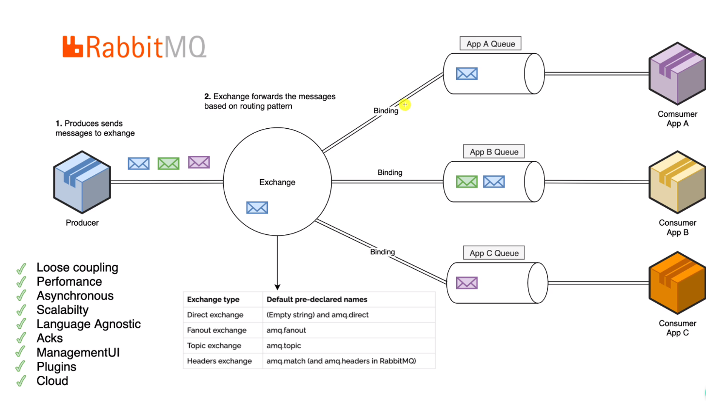
    - RabbitMQ
      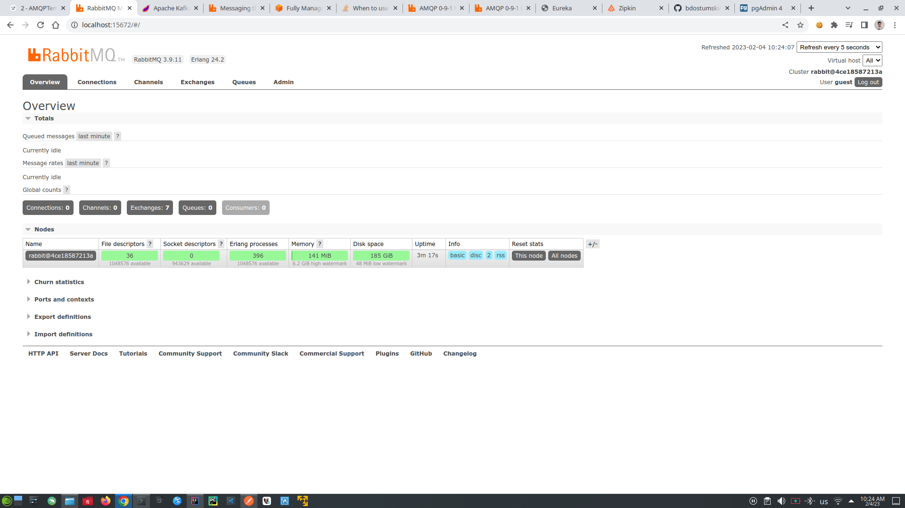
        - Create new module amqp (Advanced Message Queue Protocol) add dependencies (spring-boot-starter-amqp)
        - In this module we will (Publish message to the queue, and define the listener, to receive messages from the
          queue)
            - Send messages to the Queue and convert the Java Object into JSON, by using the JacksonConverter
            - Receive messages from the Queue and convert the JSON to the Java Object, by using the JacksonConverter
        - Second thing to do - is to setup exchange, queues and bind the exchange to the specific queue
            - So we need to setup Customer and Notification microservices, for this purpose add depencencies (
              spring-boot-starter-amqp, and my own module amqp from com.syscomz)
            - Setup Notification module to receive messages from AMQP Queue (also setup application.yml file properties
              to how to connect to our Queue (including the exchange, and the routing-key))
            - Bind Exchange and Queue together. Into NotificationConfig class add methods internalTopicExchange(),
              notificationQueue(), and internalToNotificationBinding()
            - Setup Message Producer to send messages to Exchange. Go to the package com.syscomz.amqp and create new
              class RabbitMQMessageProducer.
        - We managed to send message to our Queue (Purge messages - to delete all messages)
          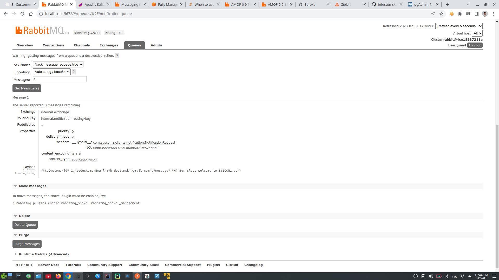
            - Send message from Customer microservice to the Exchange/Queue
                - Go to the Customer module, application.yml (add rabitmq.address:localhost:5672 configuration) and into
                  CustomerApplication class to the @SpringBootApplication add scanBasePackages, and into CustomerService
                  change direct connection to the Notification microservice with RabbitMQ microservice
        - Send messages from Queue to the Notification microservice with @RabbitListener
            - Create new package rabbitmq into Notification module and add @RabbitListener to listens for the messages
              in Queue, after that save the payload from queues into database
            - This is how the tracing looks like once we publish and consume messages from queues
              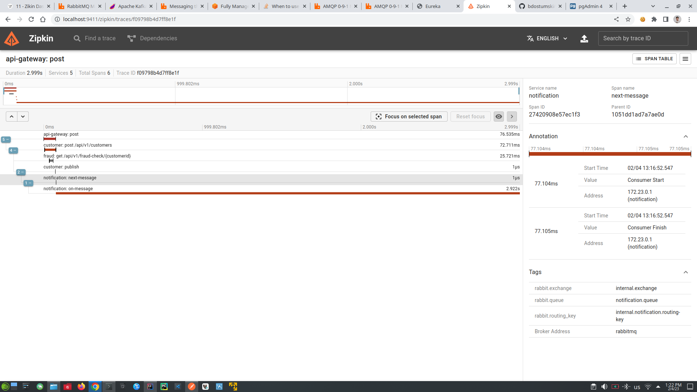
- Packaging Microservices to Runnable Jar file
    - Maven Compiler Plugin (Will use Apache Maven, and Apache Maven Compiler Plugin, links are above into **Links**
      section)
        - Into main POM.xml file add maven-compiler-plugin and specify source, and target versions to the current Java
          version in this case 18. Add <packaging>jar</packaging> to the sum POM.xml 's to specify the type of the
          packaging. After that on the right menu choose maven choose microservice -> lifecycle -> clean (to remove old
          target folder) -> compile (to create new target folder) -> package (to create jar file, into target folder).
        - After that into every module add only declarations of the dependencies, without the versions.
    - Install Root and Individual modules with Maven
        - We should first build the dependencies for our project and after that the other modules. For example in this
          project dependencies are **amqp, clients** modules. Because they are missing into .m2/repository/com
          directory.
        - Go to the root folder in this case syscomzservices and then Lifecycle click clean, after that install (this
          should install all the modules).
            - We can **install** from the root module and also every single module separately. So if for example my team
              is working on the customer module I can basically **install** the jar file independently of other teams.
- Running all jars
    - Every jar file is placed into target folder for each module
        - Only the modules that have spring-boot-mave plugin will have two jar files. The original jar file will be
          renamed to the file_name.jar.original, and the repackaged jar file will be file_name.jar. Thats because we
          have <goal>repackage</goal> into main pom.xml
    - Run microservices
        - Run all microservices one by one with spring-boot or java
            - mvn spring-boot:run | usin spring boot to run the microservice
            - java -jar file_name.jar | using java to run jar files
              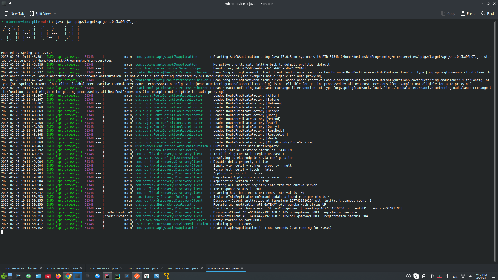
    - Run all the microservices except amqp, and clients they are not runnable, they are only dependencies to the other
      microservices
- Packaging Jars to Docker Images
    - What is Docker
        - Docker is a platform for building, running and shipping applications
        - Developers can easily build and deploy applications running in **containers**
        - Local development is the same across any environment. If it works in your local machine it will work in dev,
          staging, demo, preprod, prod, and any environment.
        - CI/CD Workflows
    - Docker Image
        - Docker Images and Containers: From our local code we are build Docker Images and from Docker Image we are run
          Docker Container.
        - Docker Image is a template were we are running our application. From one Docker Image we can run multiple
          containers.
        - Docker Image is a file used to execute code in Docker Container.
        - Docker Image is a set of instructions to build a Docker Container.
        - Contains: Application code, libraries, tools and every needed to run you application.
        - It is a blueprint, where from it, we can run multiple instances of our application.
    - Docker Container
        - Is an isolated environment for running an application
        - The Docker Container contains everything our application needs (OS, tools and binaries, and our source code)
    - Docker Architecture follows the client/server approach (where the client is that we are seen and the server is the
      Docker Host)
        - Client
            - Example of Docker Request from the Client to the Docker Daemon (docker build, docker run, docker pull)
        - Server - Docker Host
            - Docker Daemon (is responsible for the handling the request from the client). For example when the Client
              make a docker run request to the Docker Daemon if the application is not present on the localhost then
              Docker Daemon will be fetched from Registers. And when we are fetching application to our local machine,
              then from this Docker Image we can run multiple Docker Containers from this image.
        - Registers (there's public and private registers)
            - For example Docker Hub repository for docker application (Spring, Postgres, NGINX, etc.). Also for example
              Amazon Elastic Container Registry for AWS ecosystem. Google Container Registry for (GCP Google Cloud
              Provider). GitHub Packages for GitHub.
            - Docker Register is a storage and distribution system for docker images. Such as Docker Hub.
            - Public/Private Docker Registers
    - Docker Config fies are placed into home directory ~/.docker , where config.json we can configure the auth
      credentials for the corresponding Docker Register.
    - Spring Boot Maven Plugin and Jib
        - The process is: take our microservices -> put them into a JAR file -> build Docker Image -> from the Docker
          Image run Docker Containers
        - JAR: A JAR is a package file format typically used to aggregate may Java class files and associated metadata
          and resources into one file for distribution. JAR files are archive files that include a Java-specific
          manifest file. They are build on the Zip format and typically have a .jar file extension.
        - There are couple ways to build Docker Images:
            - By using Maven Plugin (check link above Spring Boot Maven Plugin Documentation). In the link read
              Packaging OCI Images. The plugin create OCI image from JAR or WAR files using Cloud Native Buildpacks (
              CNB).
            - By using Jib Plugin (check link above Jib Containerize Java Applications). Benefits from Jib are: its
              Fast, Reproducible, Daemonless. No need to write our own Docker files and calling docker build/push.
        - For configuration in the main pom.xml check dependency jib-maven-plugin and <image> tag into <properties>
        - The submodules must decide how to use this jib-maven-plugin, and if they want to use it at all (for example
          for amqp and clients there is no need for them to include this Jib configuration) for the others we want to
          build Docker Image.
            - for every single microservice we must provide the <profiles> tag. This is the build profile tag, and after
              that into maven tab from the intelliJ we can choose this profile and run the package command from the
              Lifecycle. To build the image.
            - for example the <execution> tag can be in the main pom.xml as centralized configuration, and also can be
              in every different microservice.
              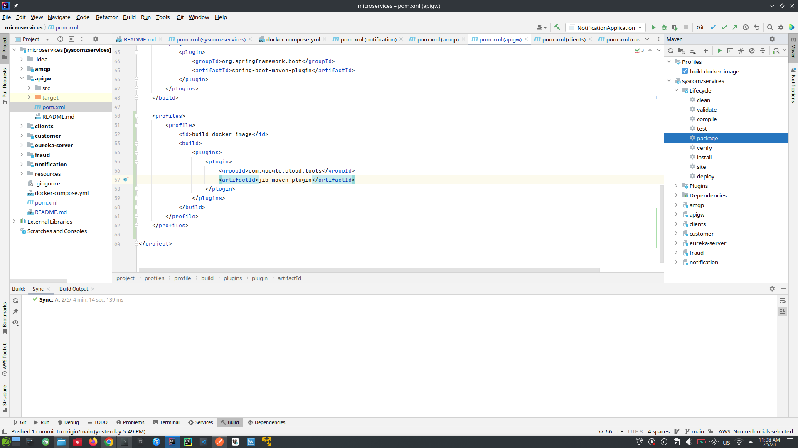
            - it is important to use **docker login** before each interaction with Docker Registers.
                - go to the apigw and write **mvn clean package -P build-docker-image** this command is the exact same
                  thing as we see in the image above (just open profiles choose the correct one and after that open the
                  microservice on which you want to execute this profile)
                - I had problem with my mvn configuration, because it was using Java version 11, so needed to change it
                  to Java version 17
                    - If you write mvn -version, and see the other version then change it by: **export JAVA_HOME=$(
                      /usr/lib64/jvm/java-17-openjdk-17 -v 17)**
        - To run **build-docker-image** profile for all my microservices I must go to the root directory and write **mvn
          clean package -P build-docker-image**, it will package and send all my microservices separately to the Docker
          Hub repository.
          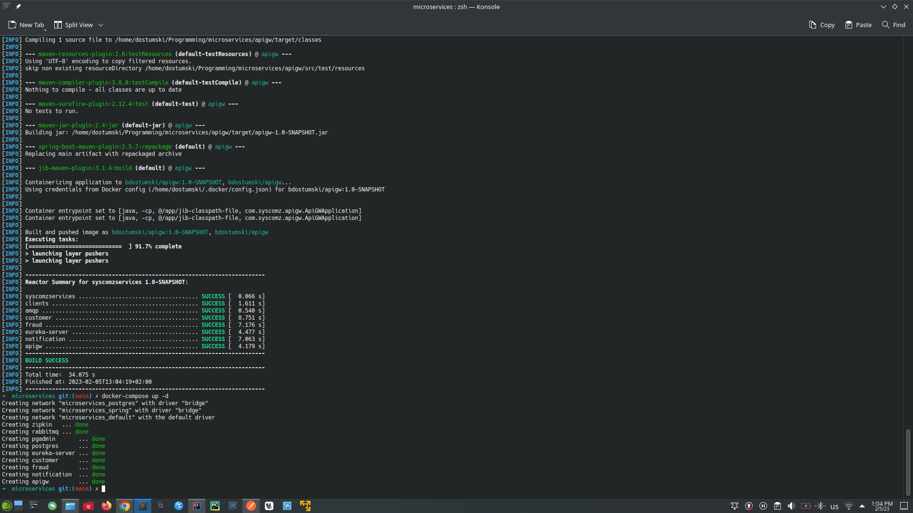
    - Adding Eureka Server and ApiGW to Docker Compose
        - Open docker-compose.yml and add all of these services from the Docker Hub repository, so that we can just say
          **docker-compose up -d** and then all of our services will start as a Docker Container
    - Docker Network
        - if I open pom.xml on each microservice will see that the addresses are added as **localhost**, which will not
          work into communication between Docker Containers. This should be replaced by Docker Network
        - into docker-compose.yml into networks add other networks, also newly created networks in this case it is *
          *spring** should be added for the all microservices into docker-compose.yml after when we specify **ports**
        - after that go to the application.yml on each microservice and change **localhost** with the container name.
          This will be done in **spring profiles** section read below
        - Spring Profiles, check the link above Spring Profiles
            - I must have different application.yml files for different environments, so duplicate the application.yml
              file from each microservice and paste it as application-docker.yml where will be the configurations for
              the Docker Containers
            - Everything that comes after application- is the profile name.
            - On the docker-compose.yml add environment: - SPRING_PROFILES_ACTIVE=docker (this is the name after
              application-docker.yml on each microservice)

    - Steps:
        - Add new service and application-docker.yaml for customer
        - Add new service and application-docker.yaml for fraud
        - Add new service and application-docker.yaml for notification
        - Note that above services need postgres network since they need database
        - Build new images with mvn clean package -P build-docker-image
        - Pull new images with docker compose pull
        - Run all applications with docker compose up -d
        - Check logs for all microsercvices with docker logs service-name
        - Test your changes. Fire up a request from postman to apigw listening on post 8083
        - Inspect Zipkin and Eureka Dashboard
        - Inspect database to make sure data being stored correctly
- Kubernetes K8s
    - What is K8s
        - It is Application Orchestrator
            - Deploy and manage applications (containers)
            - Scale up and down according demand
            - Zero Downtime Deployments
            - Rollbacks
            - And more...
    - Knowing K8s we must know what is:
        - Cluster
            - Cluster is set of nodes
            - Node is - Virtual (VM) or Physical Machine
            - Cluster is separated by Master Node and Worker Node
                - Master Node is the brain of the cluster, this is where all the decisions are made
                - Worker Node is doing the job (as running our applications)
            - Both Worker and Master Nodes communicate each-other via Qublet
            - In a cluster we can have more than one worker nodes, for this project we have (4 Nodes in Total -> 1
              Master Node, and 3 Worker Nodes)
        - Master Node and Control Plane (Master Node runs all cluster's Control Plane services. It is the brains where
          control and decisions are made)
            - Master Node contains Control Plane. The Control Plane is made of several components:
                - API Server
                    - Frontend to K8s Control Plane
                    - All communications go through API server External and Internal
                    - Exposes Restful API on port 443
                    - Authentication and Authorization checks
                    - When I am using kubectl apply -f file_name.yml, this file is actually send from the external world
                      to the API Server and also all the internal services communication goes through the API server
                    - kubectl apply -f file_name.yml -> API Server -> internal_services
                - Scheduler
                    - Watches for new workloads/pods and assigns them to a node based on several scheduling factors:
                        - Is Node Healthy?
                        - Is the Node have Enough Resources?
                        - Is the Port Available?
                        - Affinity and Anti Affinity rules
                        - And etc.
                - Cluster Store
                    - Stores configuration and state of the entire cluster
                    - K8s uses **etcd** which is distributed key value data store
                    - **etcd** is Single Source of Truth
                    - **etcd** whatch for changes (watch specific keys or directories for changes and react to changes
                      in values)
                    - kubectl apply -f file_name.yml -> API Server -> etcd (contains the configuration for our entire
                      state)
                - Controller Manager
                    - Daemon that manages the control loop. It is a Controller of the Controllers. In K8s we have a
                      bunch of controllers for example:
                        - Node Controller (when the current state doesn't match the desire state, it reacts to those
                          changes), for example we are setting (desired state = 1 node), and if we have one node and
                          this node dies then the Node Controller is responsible for bringing another node.
                    - Other Controllers:
                        - ReplicaSet Controller (is responsible for ensuring that we have the correct number of pods
                          running)
                        - Endpoint Controller (which assign pods to services)
                        - Namespace Controller
                        - Service Accounts Controller
                        - And others...
                    - What the Controller Manager does it simply watches API Server for changes and the GOAL is to watch
                      for any changes that does not match our desire state
                    - If the Desire State doesn't match the Current State then the appropriate controller kicks in to
                      try to match the desire state, so the Controller is simply watch loop.
                      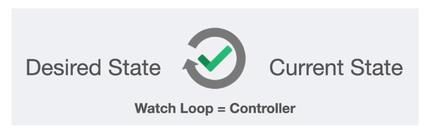
                - Cloud Manager
                    - Is responsible to interact with underlying cloud provider (AWS, GOOGLE, AZURE)
                    - It does it for:
                        - Load Balancers
                        - Storage
                        - Instances (VMs)
                - All of these components communicate each-other via API Server
                - The worker nodes are outside of Master Node's Control Plane
                  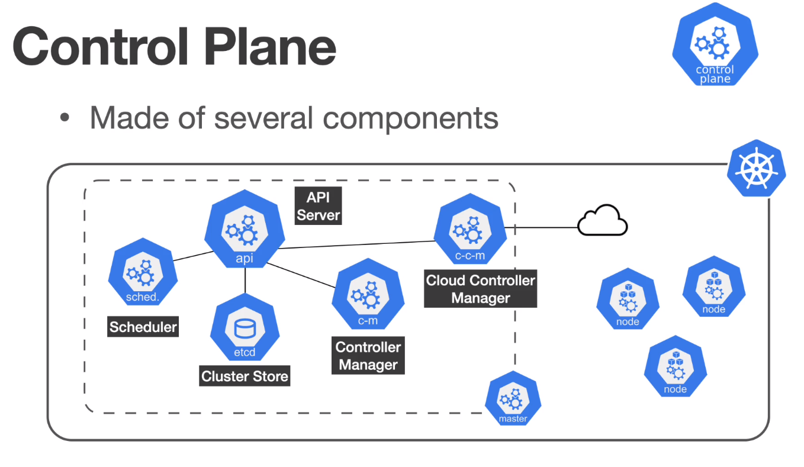
        - Worker Nodes
            - Worker Node is VM or Physical Machine often running linux
            - Provides running environment for our applications
            - Into the node we have PODs which are our applications (we can think of the POD as a docker container into
              docker world)
        - Worker Node has 3 main components:
            - Kublet
                - Kublet is Main Agent that runs on every single node
                - Receives Pod definitions from API server
                - Interacts with Container Runtime to run containers associated with the Pod
                - Reports Node and Pods state to the Master Node trough API Service
                  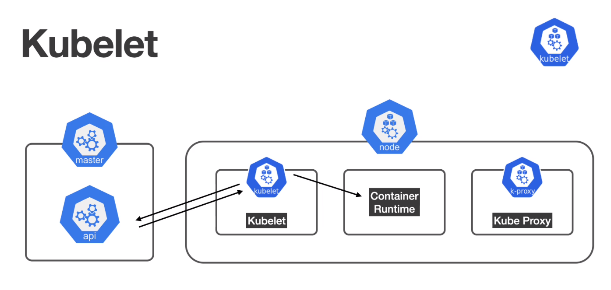
            - Container Runtime
                - Responsible for Running Containers and abstract container management for Kubernetes
                    - In it, we have Container Runtime Interface CRI (it is interfaced for 3rd party container runtime)
                    - Containerd (it is the standard container run time for K8S)
                - It is responsible to pull images from Docker Repositories for example Docker Hub, start and stop
                  containers
                    - Pull Images
                    - Start Containers
                    - Stop Containers
            - Kube Proxy
                - Agent runs on everyone through DaemonSets
                - It is responsible for:
                    - Local cluster networking
                    - Each node gets own unique IP address
                    - Routing network traffic to load balanced services
    - Running Kubernetes
        - Run in ourselves. Which is really hard.
        - Other variant is by Managed Kubernetes (used by most companies in production). Most popular Managed Kubernetes
          providers are:
            - EKS Elastik Kubernetes Service
                - EKS give us a Cluster and we decide how to manage it. There are two ways AWS Fargate used for
                  serverless containers (Deploy serverless containers), or Amazon EC2 used for wong running
                  applications (Deploy worker nodes for your EKS cluster). These services are really expensive, they are
                  used for production, or testing environments. To run local kubernetes cluster there are tree main
                  methods: minikube, kind, and docker. This tree solutions are mainly used for learning purposes, like
                  local development and CI.
            - GKE Google Kubernetes Engine
            - AKS Azure Kubernetes
            - And other...
        - To be managed means to give the Master Node and all the services in it to be managed by 3rd party provider. We
          should focus only in Worker Nodes this is where our application run.
    - Minikube
        - minikube start --memory=14g start minikube with 14g of ram
        - When we set up and start minikube, we can use kubectl, to command our minikube cluster
    - Kubectl (Kubernetes Command Line Tool)
        - For now, we have minikube with 1 node, and this is the master node, and inside we have Control Plane with all
          the components that we learned for the Master Node.
        - This node has IP address, which we can grab it by running minikube ip
        - Kuectl lets our machine communicate with our minikube cluster
        - Kubectl commands gains our cluster:
            - Deploy
            - Inspect
            - Edit resources
            - Debug
            - View Logs
            - etc
    - Pod (Is a group of one or more containers, represents running process, and share same network and volumes. Never
      create Pods on its own. Use Controllers Instead for example Deployment. Pods are Ephemeral (no long live) and
      Disposable)
        - A pod is the smallest deployable unit in Kubernetes and not containers
        - The pod can contain:
            - The smallest unit for kubernetes is a pod, for docker is a container
            - Main Container, which is our application
            - May have, or may not have Init Container, or more init containers these are containers that are executed
              before the Main Container
            - May or may not have some Side Containers, these are the containers that are support our Main Container.
              For example, you may have a container which acts as a proxy to your main container.
            - In the pods we can have Volumes, this is how containers share data between them
            - The way that these containers communicate each-other within a pod is using localhost and then whatever
              port that they expose
            - The pod has a unique IP address, which means that if another pod wants to talk with this pod it uses the
              unique IP address
              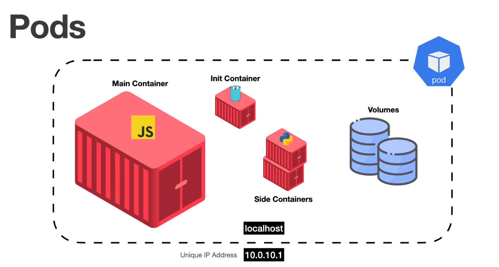
    - Deployments (Never deploy pods using kind:Pod in our yml files)
        - Manages release of new application
        - Zero downtime deployments
        - Create ReplicaSet
        - It works like (DEPLOYMENT -> it creates REPLICASET (replica-set cares of the number of pods are always
          running))
        - If we have V1 of our app if we want to release a new version of our app, k8s will take care of the deployment
          for us. It will create another replica set for example V2 and when everything is ok on V2, then the traffic to
          the V1 will be stopped.
    - Services (k-proxy)
        - Bad practices
            - How do we access our app?
            - Not using port-forward. Only for testing purposes
            - Never rely on Pod IP addresses
        - Services have
            - Sable IP address
            - Stable DNS Name
            - Stable Port
        - Types of Services
            - ClusterIP (Default)
            - NodePort
            - ExternalName
            - LoadBalancer
    - Service Discovery (SVC)
        - It is a mechanism for applications and microservices to locale each-other on a network
        - DNS (Domain Name System) map ip address to the name.
        - KubeProxy
            - Network Proxy that runs on each node. Implementing part of the Kubernetes Service.
            - Maintains network rules to allow communication to pods from inside and outside the cluster
            - Implements a controller that watches the API server for new Services and Endpoints
            - Creates Local IPVS rules that tell node to intercept traffic destined to the Service ClusterIP (IPVS -> IP
              Virtual Server)
- Deploying Postgres RabbitMQ and Zipkin to K8s
    - It is important to know that we should never deploy our databases in our kubernetes cluster. It should come from
      the outside like RDS (Amazon Relational Database Service) for example.
      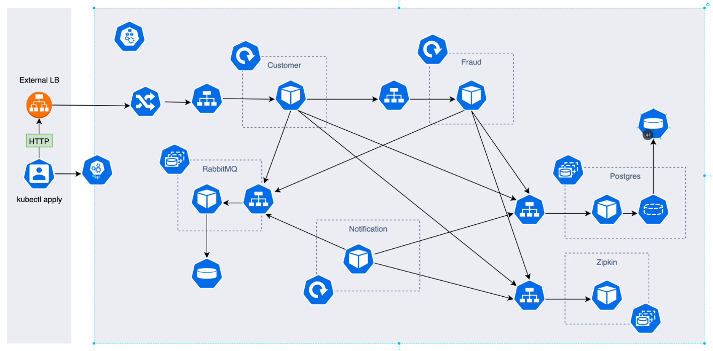
    - Because the type of the service of Zipkin is LoadBalancer to have access to it, we should write minikube tunnel
      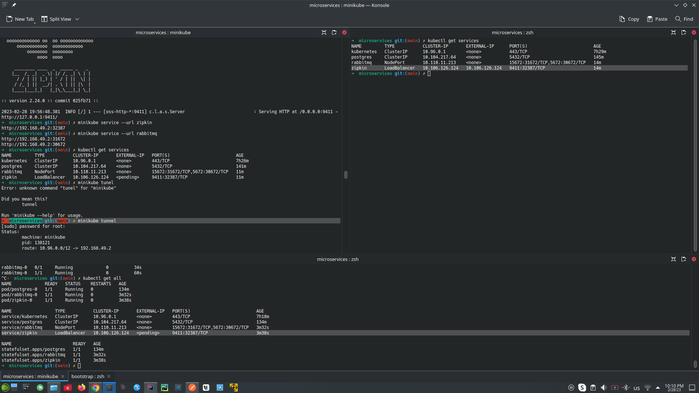
- Refactoring Microservices for k8s
    - k8s offers a service type called LoadBalancer and this will provision a load balancer according to your cloud
      environment. I.e AWS, GCP or Azure.
    - It best to use managed load balancer instead of managing and configure ours.
    - Disabling Eureka (we no more need from Eureka Server for Service Discovery, because K8s offer that for us)
        - Into .yml files will see this line of code -> enabled: false # Disable Eureka Server, because we are using
          Service Discovery from K8s
        - Remove Eureka Server and API Gateway from docker-compose.yml file (for traceability added other versions to
          the old ones)
    - For development purposes it is OK to send request directly to the customer API like this localhost:
      8080/api/v1/customers, we no longer need to pass through Api Gateway as before localhost:8083/api/v1/customers or
      Load Balancer.
- Deploying Microservices to k8s
    - The deployment files are into k8s/minikube/services directory
    - Services Types:
        - NodePort (can only be access by internal pods)
        - LoadBalancer (can be access by external world)
    - If we want to access our LoadBalancers we can write minikube tunnel
    - kubectl apply -f service_name, first start bootstrap directory after that services
    - minikube tunnel
    - kubectl get svc
    - use external ip address
- Managed Kubernetes Cluster with Linode (Linode is cheap and easy to use cloud provider)
  - Commands for this sections

```
  Commands Used

export KUBECONFIG=~/amigoscode-kubeconfig.yml

kubectl apply -f path
kubectl delete -f path

kubectl get po
kubectl get svc
kubectl get po -w

kubectl logs postgres-0

kubectl exec -it postgres-0 -- psql -U amigoscode

kubectl describe pod podName

kubectl logs podName
kubectl logs -f podName

kubectl exec -it postgres-0 -- psql -U linpostgres -h lin-4621-419-pgsql-primary.servers.linodedb.net
kubectl exec -it postgres-0 -- psql --help
kubectl exec -it postgres-0 -- psql -U linpostgres -h lin-4621-419-pgsql-primary.servers.linodedb.net
kubectl exec -it postgres-0 -- bash

psql -U host -U username -d database
\d
\dt
\c databaseName
create database dbName;
select * from tableName;
```
- Create Linode Account
    - Kubernetes Cluster with one Node with 8Gib RAM
      - Kubernetes API Endpoint 
        - IP Address is the ip of our node
        - Kubernetes API Endpoint -> allows us to send commands using kubectl
        - Kubeconfig -> this yaml file is used to connect to our cluster
        - There is alsow "Upgrade to HA" which means to Upgrade to High Availability Control Plane
        - And also we can add new node to the pool
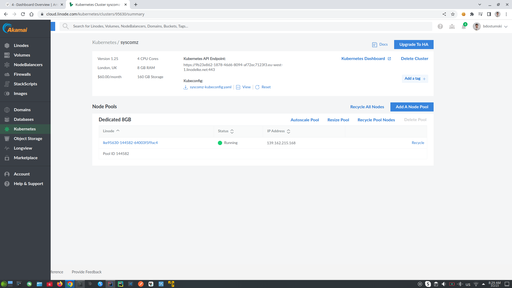
    - Download Kubeconfig to use it for accessing the server through kubectl
      - Export syscomz-kubeconfig.yml file as variable of the environment: export KUBECONFIG=syscomz-kubeconfig.yml
        - When we export this yml file every command make from kubectl will be executed for the Linode server. For example **kubectl get nodes** will get nodes from Linode server.
- Deploying Microservices and check the result in Zipkin
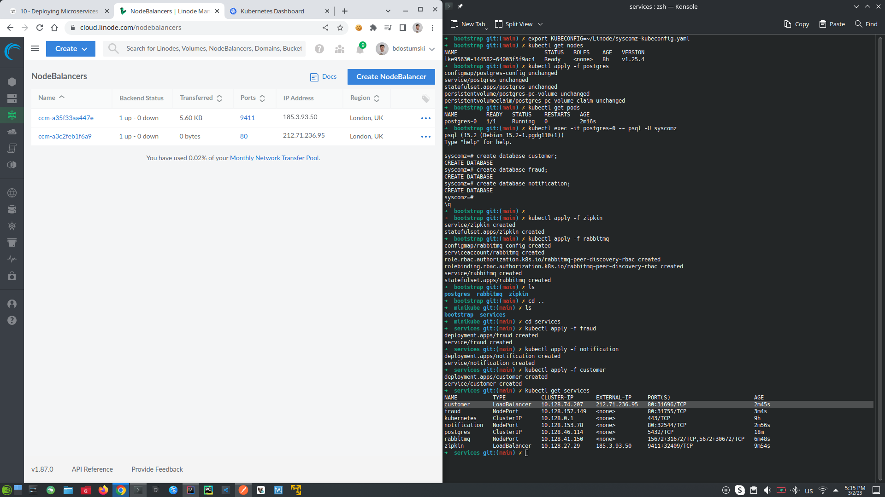
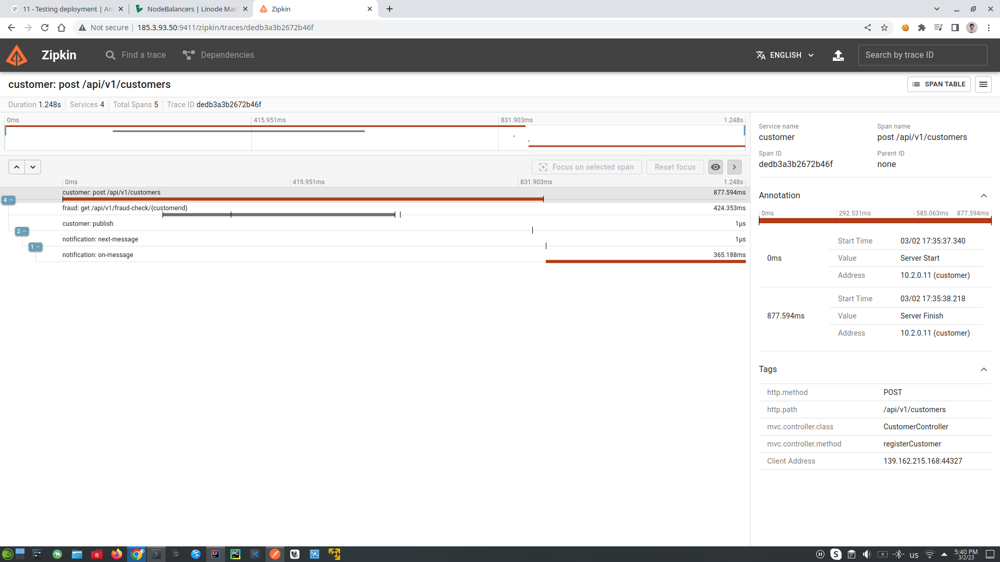
- Destroy Resources
  - kubectl delete -f service_name | delete resources
    


